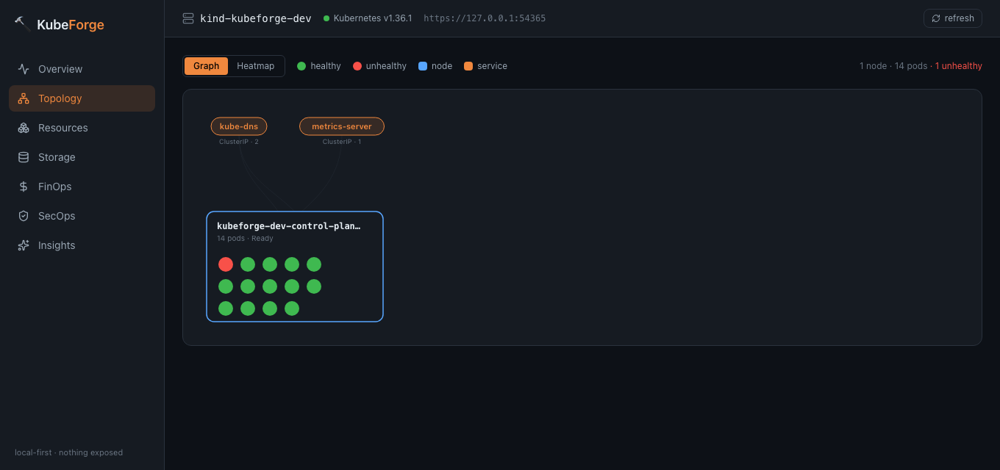

<div align="center">

# 🔨 KubeForge

**Une console web _local-first_ pour vraiment _comprendre_ — et optimiser — son cluster Kubernetes.**

Un seul binaire. Une seule commande. Il ouvre une console dans votre navigateur, lit votre cluster, et répond aux questions que les outils habituels laissent en suspens : _où est-ce que je gaspille de l'argent, comment tout ça est câblé, est-ce que ça s'améliore ou se dégrade avec le temps, et où sont les trous de sécurité ?_

[](https://github.com/Mrg77/kubeforge/actions/workflows/ci.yml)
[](LICENSE)
[](go.mod)

[English](README.md) · [Français](README.fr.md)


</div>

---

## Pourquoi cet outil existe

Il existe déjà de bons outils Kubernetes. `kubectl` est la source de vérité, mais c'est un tuyau d'incendie. `k9s` est une superbe interface terminal — mais c'est une table en temps réel : elle n'a aucune mémoire, elle ne parle pas de coûts, elle ne vous dit pas que votre RBAC est grand ouvert. Lens est magnifique — puis il est passé en closed-source, derrière un login. Construire son workflow là-dessus, c'est fragile.

KubeForge, c'est la version honnête et local-first de cette idée. Un seul binaire Go avec toute l'interface web embarquée dedans. Vous le lancez, il parle à votre cluster depuis votre machine, et **rien n'est exposé** — il écoute sur `127.0.0.1` par défaut. Pas de compte, pas de télémétrie, pas de SaaS au milieu.

Le pari est simple : ne pas faire _un énième navigateur de ressources_. Faire les trois ou quatre vues qui répondent aux questions que les autres n'adressent pas :

| La question | La réponse de KubeForge |
| --- | --- |
| **Où part mon argent ?** | Une treemap FinOps — le coût par namespace, coloré selon la part de gaspillage. |
| **Comment mon cluster est-il vraiment câblé ?** | Un graphe de topologie — services → les pods qu'ils sélectionnent → le node de chacun. |
| **Est-ce que ça s'améliore ou empire ?** | Des courbes avec mémoire, dont une bande CPU réservé-vs-utilisé où l'écart hachuré _est_ le gaspillage. |
| **Où sont les failles de sécurité ?** | Un scan SecOps déterministe — pods privilégiés, accès hôte, RBAC trop large, tags d'image mutables. |
| **Et tout le reste ?** | Un navigateur de ressources universel qui liste **tous** les types du cluster — natifs et vos CRD. |

---

## Ce qu'il y a dedans

- **Overview** — la santé du cluster d'un coup d'œil : pods (les malades d'abord), nodes, redémarrages. L'écran qu'on regarde en premier.
- **Topology** — deux lentilles sur le même graphe. Une vue *graphe* pour le câblage (survolez un service, tout son chemin s'illumine) et une vue *heatmap* qui reste lisible au-delà de 500 pods.
- **Resources** — un navigateur universel bâti sur le discovery + dynamic client : il liste tout ce que l'API server connaît, y compris les ressources custom. Les clusters self-managed avec des CRD maison sont traités comme des citoyens de première classe.
- **Storage** — PV, PVC et StorageClass au même endroit, avec les volumes orphelins et les claims non montés mis en évidence (ça, c'est du stockage que vous payez sans l'utiliser).
- **FinOps** — un moteur de coût et de gaspillage. Il raisonne sur les deux vraies causes du gâchis Kubernetes — les ressources réservées mais pas utilisées, et les workloads sans aucune limite — et en tire des recommandations de right-sizing et une estimation de coût mensuel. La treemap indique où regarder en premier.
- **SecOps** — un scan de posture de sécurité déterministe (pas de LLM, pas de devinette) : conteneurs privilégiés, `hostNetwork`/`hostPID`, capabilities dangereuses, exécution en root, tags d'image mutables, namespaces sans NetworkPolicy, cluster-admin donné aux mauvais sujets. Chaque finding vient avec un _pourquoi_ en clair et un correctif.
- **Insights** — les tendances dans le temps, enregistrées localement en SQLite, plus une **couche IA optionnelle** (voir plus bas).

---

## La couche IA — optionnelle, avec votre propre clé

Il y a un bouton **Ask AI** dans le header, sur chaque vue. C'est totalement optionnel et désactivé par défaut.

Quand vous l'activez, vous fournissez votre propre clé — **Anthropic**, ou n'importe quel endpoint **compatible OpenAI**, y compris un **Ollama local** pour que rien ne quitte votre machine. KubeForge fait alors deux choses qu'un dashboard classique ne sait pas faire :

1. **Résumer & prioriser** — transformer un mur de findings en « voici les trois choses à corriger en premier, et pourquoi ».
2. **Analyser les tendances** — regarder l'historique enregistré et vous donner la _direction_ : le gaspillage augmente-t-il, ce correctif de sécurité a-t-il tenu ?

**Ce qui est envoyé :** uniquement les _findings_ — des compteurs, des titres, des chiffres de tendance. Jamais d'objets bruts du cluster, jamais de secrets. La clé est stockée localement (`0600`) et n'est jamais renvoyée au navigateur. Si vous ne configurez rien, tout le reste fonctionne exactement pareil.

---

## Installation & lancement

**Avec Homebrew** (dès que la première release est taguée) :

```bash
brew install mrg77/tap/kubeforge
kubeforge serve
```

**Ou compiler depuis les sources** — il vous faut Go 1.26+ et un kubeconfig qui atteint un cluster :

```bash
git clone https://github.com/Mrg77/kubeforge.git
cd kubeforge
# compiler le frontend embarqué, puis le binaire unique
( cd web/ui && npm ci && npm run build )
go build -o kubeforge .

# le lancer — il se connecte à votre contexte courant et ouvre le navigateur
./kubeforge serve
```

C'est tout. La console est sur `http://127.0.0.1:7777`.

### Options courantes

```bash
./kubeforge serve --context prod-eu         # choisir un contexte du kubeconfig
./kubeforge serve --kubeconfig ./kubeconfig # viser un fichier précis
./kubeforge serve --port 8080               # ou --port 0 pour un port libre auto
./kubeforge serve --no-open                 # ne pas ouvrir le navigateur
./kubeforge serve --host 0.0.0.0            # l'exposer (lisez la note d'abord)
```

> **À propos de l'exposition.** Le bind `127.0.0.1` par défaut fait que la console est à vous et à personne d'autre. Vous _pouvez_ faire tourner KubeForge sur un serveur et l'exposer avec `--host 0.0.0.0` — mais il devient alors accessible sur le réseau, donc mettez-le derrière une authentification et du TLS. Le local-first est le défaut, et ce n'est pas un hasard.

### Metrics

Les chiffres d'usage FinOps et la bande réservé-vs-utilisé ont besoin de [metrics-server](https://github.com/kubernetes-sigs/metrics-server) dans le cluster. Tout le reste fonctionne sans — KubeForge masque simplement la moitié « usage » et le dit, plutôt que d'inventer des chiffres.

---

## Aperçus

| | |
| --- | --- |
| **FinOps** — coût par namespace, coloré par gaspillage | **SecOps** — findings, sévérité, et le correctif |
|  |  |
| **Topology** — le câblage, service → pod → node | **Insights** — CPU réservé vs. utilisé dans le temps |
|  |  |

---

## Comment c'est construit

- **Go + client-go** pour le backend. Un client typé pour les vues courantes, et le **discovery + dynamic client** pour le navigateur de ressources universel — c'est comme ça qu'il liste des CRD dont il n'a jamais entendu parler.
- **React + TypeScript + Vite + Tailwind** pour l'UI, **Recharts** et du SVG écrit à la main pour les visualisations.
- Tout le frontend est compilé et **embarqué dans le binaire** avec `go:embed` : livrer KubeForge, c'est livrer un fichier.
- **SQLite** (pur-Go, sans CGO) pour l'historique local — de petits résumés, jamais des dumps complets du cluster.
- Tout est en lecture seule. KubeForge regarde votre cluster ; il ne le modifie jamais.

---

## Statut & roadmap

KubeForge est jeune et avance vite. Les cinq piliers ci-dessus fonctionnent déjà de bout en bout. Au programme ensuite : signaux d'inodes et de pression disque par node, alertes prédictives de saturation du stockage, et empaquetage (Homebrew, un binaire de release) pour ne plus avoir à le compiler soi-même.

Les issues et les idées sont les bienvenues.

## Licence

MIT.
