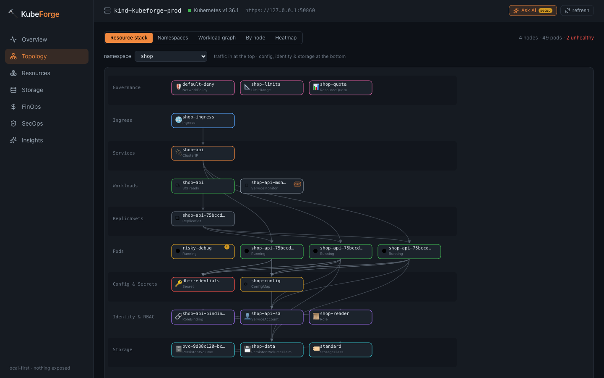
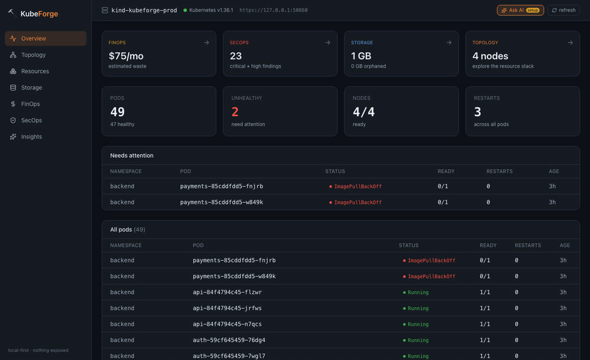
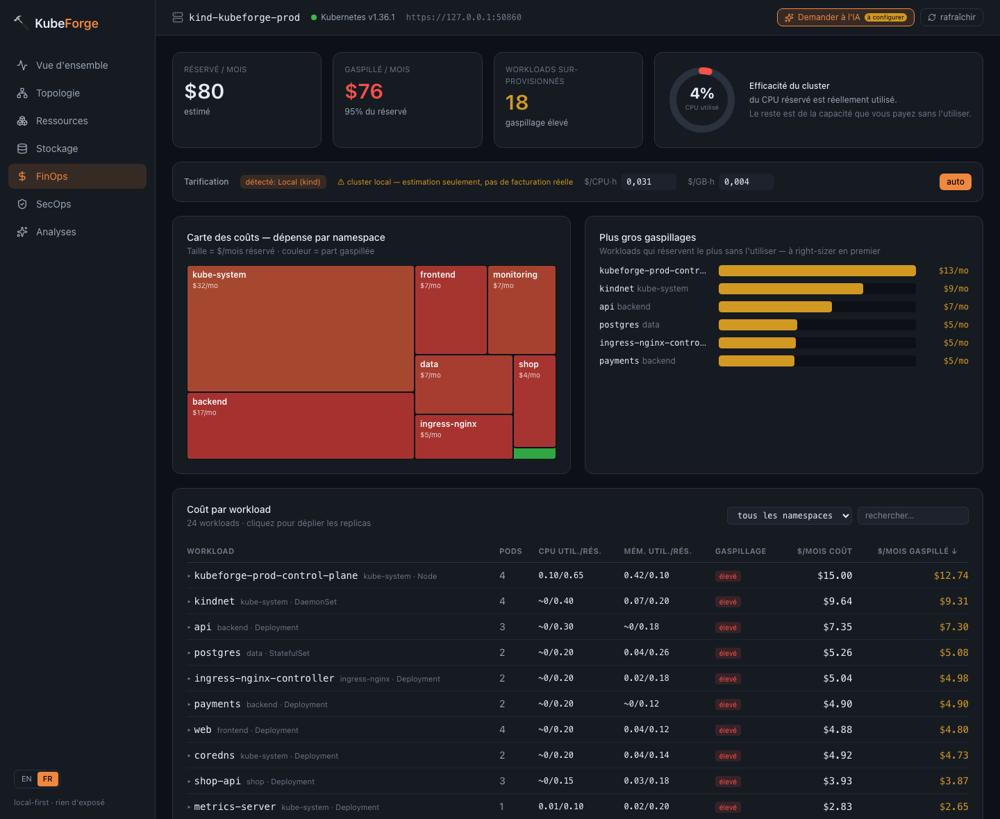
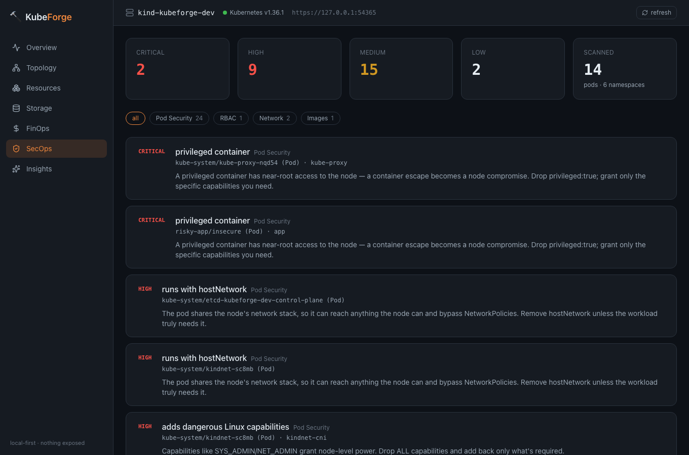
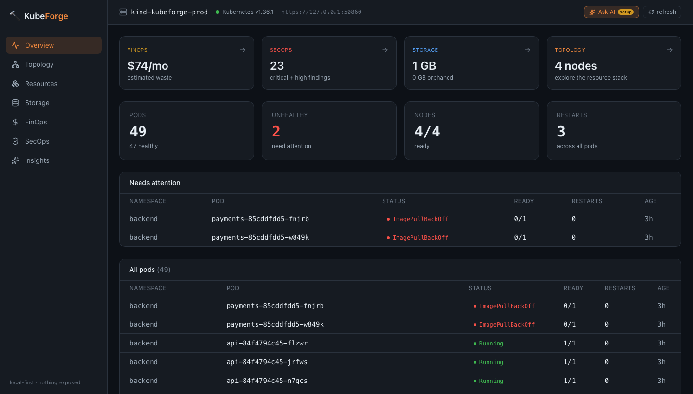
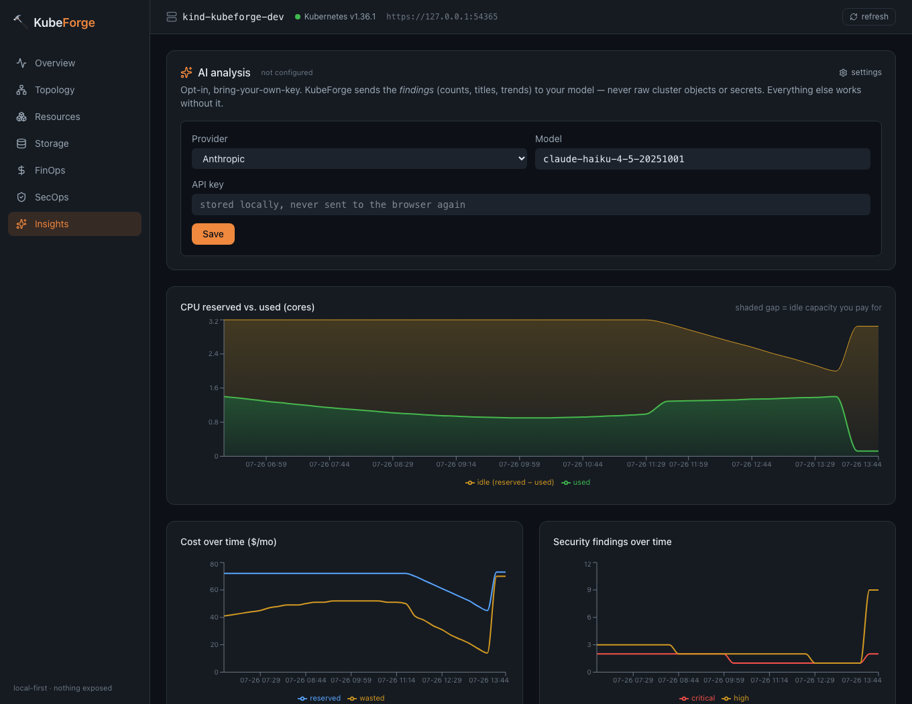

<div align="center">

# 🔨 KubeForge

**Une console web _local-first_ pour vraiment _comprendre_ — et optimiser — son cluster Kubernetes.**

Un seul binaire. Une seule commande. Il ouvre une console dans votre navigateur, lit votre cluster, et répond aux questions que les outils habituels laissent en suspens : _où est-ce que je gaspille de l'argent, comment tout ça est câblé, est-ce que ça s'améliore ou se dégrade avec le temps, et où sont les trous de sécurité ?_

[](https://github.com/Mrg77/kubeforge/actions/workflows/ci.yml)
[](LICENSE)
[](go.mod)

[English](README.md) · [Français](README.fr.md)



<sub>Le **Resource stack** : un namespace dessiné du trafic entrant (haut) jusqu'à la config, l'identité et le stockage (bas) — chaque arête est une référence réelle.</sub>

<br>



<sub>Un tour rapide : le hub, le Resource stack, le graphe de workloads, les dashboards FinOps et SecOps, et les tendances dans le temps.</sub>

</div>

---

## Pourquoi cet outil existe

Il existe déjà de bons outils Kubernetes. `kubectl` est la source de vérité, mais c'est un tuyau d'incendie. `k9s` est une superbe interface terminal — mais c'est une table en temps réel : elle n'a aucune mémoire, elle ne parle pas de coûts, elle ne vous dit pas que votre RBAC est grand ouvert. Lens est magnifique — puis il est passé en closed-source, derrière un login. Construire son workflow là-dessus, c'est fragile.

KubeForge, c'est la version honnête et local-first de cette idée. Un seul binaire Go avec toute l'interface web embarquée dedans. Vous le lancez, il parle à votre cluster depuis votre machine, et **rien n'est exposé** — il écoute sur `127.0.0.1` par défaut. Pas de compte, pas de télémétrie, pas de SaaS au milieu.

Le pari est simple : ne pas faire _un énième navigateur de ressources_. Faire les trois ou quatre vues qui répondent aux questions que les autres n'adressent pas :

| La question | La réponse de KubeForge |
| --- | --- |
| **Comment tout s'emboîte dans ce namespace ?** | Le **Resource stack** — chaque objet dessiné bas→haut (Ingress → Service → Pod → Config/RBAC/Storage), chaque arête étant une référence réelle lue dans une spec. Survolez pour l'IP, l'image, le coût mensuel ; cliquez pour le manifeste live et les events. |
| **Où part mon argent ?** | Un **dashboard** FinOps — jauge d'efficacité, prix éditables (presets AWS/GCP/Azure), coût groupé par workload, et une treemap du coût par namespace colorée par gaspillage. |
| **Est-ce que ça s'améliore ou empire ?** | Des courbes avec mémoire, dont une bande CPU réservé-vs-utilisé où l'écart hachuré _est_ le gaspillage. |
| **À quel point c'est sécurisé ?** | Un scan SecOps déterministe avec un **score de posture** — pods privilégiés, accès hôte, RBAC trop large, tags d'image mutables, chacun avec un _pourquoi_ et un correctif. |
| **Et tout le reste ?** | Un navigateur de ressources universel qui liste **tous** les types du cluster — natifs et vos CRD. |

---

## Ce qu'il y a dedans

- **Overview** — un hub : quatre cartes-piliers (coût, sécurité, stockage, topologie) donnent le titre de chaque zone et y mènent, au-dessus d'une table de santé avec les pods malades en premier.
- **Topology** — deux lentilles sur le cluster :
  - **Resource stack** _(la vedette)_ — un namespace en graphe empilé, du haut niveau (Ingress) au bas niveau (Secrets, RBAC, stockage). Les nœuds portent des alertes SecOps inline et un badge `CRD` pour les ressources d'opérateurs ; survolez pour les infos (IP, image, coût mensuel), cliquez pour le manifeste live (secrets masqués) et les events récents.
  - **Heatmap** — une cellule par pod, colorée par santé (et ambre si le pod redémarre souvent), pour l'état d'un gros parc (500+ pods). Les cellules trient les problèmes en haut à gauche ; survolez pour l'identité du pod, son node et ses redémarrages ; cliquez pour ouvrir ses events.
- **FinOps** — un vrai dashboard de coûts : jauge d'efficacité (utilisé vs réservé), coût **groupé par workload** (dépliable vers les pods) avec filtre/recherche/tri, un graphe des plus gros gaspillages, et la treemap du coût par namespace. La tarification **détecte automatiquement ton cloud** via le `providerID` des nodes (AWS/GCP/Azure) et applique les prix correspondants — un cluster local (kind/minikube) est signalé honnêtement « estimation seulement, pas de facturation réelle ». Tu peux toujours surcharger le prix par cœur / par Go.
- **SecOps** — un scan de posture déterministe avec un **score de 0 à 100** calculé sur _tes_ workloads (namespaces système exclus, pour que les pods privilégiés de Kubernetes ne plombent pas ta note). Il signale : conteneurs privilégiés, `hostNetwork`/`hostPID`, capabilities dangereuses, exécution en root, tags d'image mutables, namespaces sans NetworkPolicy, cluster-admin mal attribué. Les findings identiques sont **groupés** (« peut s'exécuter en root · 33 objets » au lieu de 33 lignes), le bruit système est masqué par défaut, chaque finding a un _pourquoi_ + un correctif et un saut vers le Resource stack, et tout le rapport s'exporte en **CSV**.
- **Storage** — PV, PVC et StorageClass au même endroit, avec les volumes orphelins et les claims non montés mis en évidence et **chiffrés en coût** (du stockage que vous payez sans l'utiliser).
- **Resources** — un navigateur universel bâti sur le discovery + dynamic client : il liste tout ce que l'API server connaît, y compris les ressources custom.
- **Insights** — les tendances dans le temps, enregistrées localement en SQLite, plus une **couche IA optionnelle** (voir plus bas).

---

## La couche IA — optionnelle, et gratuite

Il y a un bouton **Ask AI** dans le header, sur chaque vue. Il ouvre un **chat avec votre cluster** — posez n'importe quelle question et obtenez une réponse ancrée dans les scans en direct, pas une supposition :

- _« Pourquoi `payments` est en panne ? »_ → il lit les **events** du pod et vous dit : `ImagePullBackOff`, le tag d'image n'existe pas, voici le `kubectl` pour confirmer.
- _« Où je gaspille le plus ? »_ → il lit le **FinOps** et nomme le workload, l'écart réservé-vs-utilisé, et un extrait `resources:` prêt à appliquer.
- _« Y a-t-il des points faibles dans mon archi ? »_ → il lit la posture et la topologie et pointe les vrais risques.

Des questions suggérées vous lancent en un clic, et c'est une vraie conversation multi-tours (posez des questions de suivi). Sous le capot, chaque question est répondue à partir des scans déterministes (santé/sécurité/coût) plus les events de tout pod que vous nommez — l'IA **explique et corrige**, elle n'invente jamais de findings.

**Pas besoin de payer.** Choisissez n'importe quel fournisseur — **Gemini** et **Groq** donnent une **clé API gratuite** (sans carte), et ils sont mis en avant. **Claude, ChatGPT, Mistral, DeepSeek, Grok, OpenRouter** et n'importe quel **endpoint compatible OpenAI custom** (LiteLLM/vLLM auto-hébergé…) sont là aussi, pour ceux qui ont déjà une clé API payante. Un abonnement chat (Claude Max, ChatGPT Plus) n'**inclut pas** l'accès API — KubeForge vous le dit au lieu de vous laisser tomber sur une erreur cryptique « pas de crédit ». Saisissez votre clé, cliquez **charger mes modèles** pour récupérer votre vraie liste, **testez la connexion**, enregistrez.

**Parle votre langue.** L'analyse revient dans la langue de l'UI (FR/EN).

**Ce qui est envoyé :** uniquement les _findings_ — des compteurs, des titres, des noms de ressources, des chiffres de tendance. Jamais d'objets bruts du cluster, jamais de secrets. La clé est stockée localement (`0600`) et n'est jamais renvoyée au navigateur. Si vous ne configurez rien, tout le reste fonctionne exactement pareil.

---

## Installation & lancement

**Avec Homebrew** (dès que la première release est taguée) :

```bash
brew install mrg77/tap/kubeforge
kubeforge serve
```

**Ou compiler depuis les sources** — il vous faut Go 1.26+ et un kubeconfig qui atteint un cluster :

```bash
git clone https://github.com/Mrg77/kubeforge.git
cd kubeforge
# compiler le frontend embarqué, puis le binaire unique
( cd web/ui && npm ci && npm run build )
go build -o kubeforge .

# le lancer — il se connecte à votre contexte courant et ouvre le navigateur
./kubeforge serve
```

C'est tout. La console est sur `http://127.0.0.1:7777`.

### Options courantes

```bash
./kubeforge serve --context prod-eu         # choisir un contexte du kubeconfig
./kubeforge serve --kubeconfig ./kubeconfig # viser un fichier précis
./kubeforge serve --port 8080               # ou --port 0 pour un port libre auto
./kubeforge serve --no-open                 # ne pas ouvrir le navigateur
./kubeforge serve --host 0.0.0.0            # l'exposer (lisez la note d'abord)
```

> **À propos de l'exposition.** Le bind `127.0.0.1` par défaut fait que la console est à vous et à personne d'autre. Vous _pouvez_ faire tourner KubeForge sur un serveur et l'exposer avec `--host 0.0.0.0` — mais il devient alors accessible sur le réseau, donc mettez-le derrière une authentification et du TLS. Le local-first est le défaut, et ce n'est pas un hasard.

### Metrics

Les chiffres d'usage FinOps et la bande réservé-vs-utilisé ont besoin de [metrics-server](https://github.com/kubernetes-sigs/metrics-server) dans le cluster. Tout le reste fonctionne sans — KubeForge masque simplement la moitié « usage » et le dit, plutôt que d'inventer des chiffres.

---

## Aperçus

| | |
| --- | --- |
| **FinOps** — jauge d'efficacité, prix éditables, coût par workload | **SecOps** — score de posture, filtres de sévérité, correctif par finding |
|  |  |
| **Overview** — le hub des piliers | **Insights** — CPU réservé vs. utilisé dans le temps |
|  |  |

---

## Pensé pour les vrais clusters

Une démo tient sur trois pods ; un vrai cluster en a des centaines. KubeForge est conçu pour rester lisible et rapide à cette échelle :

- **Findings groupés.** SecOps regroupe les findings identiques — « peut s'exécuter en root · 33 objets » est une carte dépliable, pas 33. Les namespaces système (kube-system, kindnet…) sont masqués par défaut car ils sont privilégiés _par design_ et noieraient tes vrais problèmes.
- **Score de posture honnête.** La note 0–100 est calculée sur tes workloads uniquement, pour que les pods système privilégiés de Kubernetes ne tirent pas chaque cluster vers un « F ».
- **Couches plafonnées.** Le Resource stack affiche les N premiers objets par couche avec un « +N de plus », et remonte les problèmes (en panne, puis à risque) en tête — un namespace de 100 pods reste lisible sans jamais cacher ce qui compte. La heatmap de topologie passe l'échelle des 500+ pods.
- **Tables paginées.** Les longues listes (la table de pods de la vue d'ensemble) sont recherchables et paginées : l'UI s'affiche instantanément au lieu d'un mur de lignes.
- **Scans mis en cache.** Les scans complets (SecOps, FinOps, Stockage) sont mémorisés quelques secondes : la rafale d'appels d'une seule vue se réduit à un vrai scan.

## Bilingue (FR / EN)

Toute l'UI est disponible en **français et en anglais** — un bouton dans la barre latérale, la langue du navigateur détectée au premier lancement, ton choix mémorisé. Les findings de sécurité, les libellés de coût, le resource stack — tout est traduit, pas seulement les menus.

## Comment c'est construit

- **Go + client-go** pour le backend. Un client typé pour les vues courantes, et le **discovery + dynamic client** pour le navigateur de ressources universel — c'est comme ça qu'il liste des CRD dont il n'a jamais entendu parler.
- **React + TypeScript + Vite + Tailwind** pour l'UI, **Recharts** et du SVG écrit à la main pour les visualisations.
- Tout le frontend est compilé et **embarqué dans le binaire** avec `go:embed` : livrer KubeForge, c'est livrer un fichier.
- **SQLite** (pur-Go, sans CGO) pour l'historique local — de petits résumés, jamais des dumps complets du cluster.
- Tout est en lecture seule. KubeForge regarde votre cluster ; il ne le modifie jamais.

---

## Statut & roadmap

KubeForge est jeune et avance vite. Tous les piliers ci-dessus fonctionnent de bout en bout, il s'installe via un cask Homebrew et un binaire de release, il est bilingue (FR/EN), et les dashboards Resource stack, FinOps et SecOps sont validés sur un vrai cluster multi-nodes avec groupement, pagination, détection automatique des prix cloud et cache des scans pour l'échelle. Au programme ensuite : signaux d'inodes et de pression disque par node, alertes prédictives de saturation du stockage, et des arêtes CRD plus riches dans le stack.

Les issues et les idées sont les bienvenues.

## Licence

MIT.
